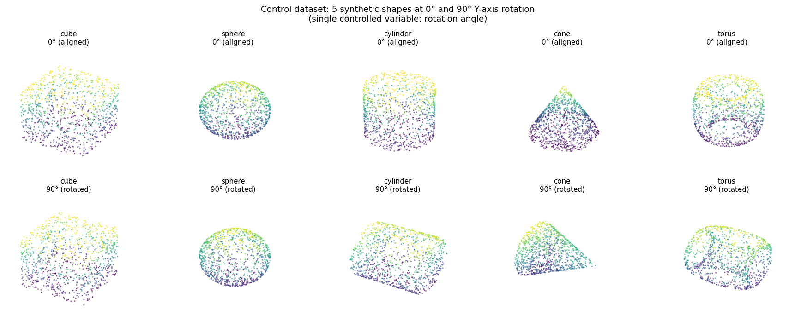
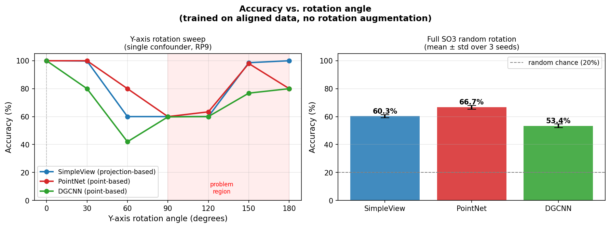

# Does Multi-View Projection Make SimpleView More Rotation-Robust?

**A Controlled Experiment | Deep Learning Assignment 2**

---

## Motivation and Hypothesis

Automatic 3D object classification matters for autonomous driving and robotic manipulation, where LiDAR sensors produce *point clouds* — unordered sets of 3D coordinates. A key practical requirement: sensors don't guarantee a canonical object orientation. A robust classifier must recognise objects regardless of pose.

Two families of methods tackle this differently:

**Point-based methods** operate directly on raw 3D coordinates. [PointNet (Qi et al., 2017)](https://arxiv.org/abs/1612.00593) applies shared MLPs per point and pools a global descriptor. It includes a *T-Net* — a sub-network that predicts a 3×3 transformation matrix applied to the input before classification, an explicit mechanism to handle rotation. [DGCNN (Wang et al., 2019)](https://arxiv.org/abs/1801.07829) constructs a local k-NN graph and learns edge features between neighbours for richer local geometry.

**Projection-based methods** convert point clouds to 2D images first. [SimpleView (Goyal et al., 2021)](https://arxiv.org/abs/2106.05304) renders each point cloud as **six orthogonal depth images** (±X, ±Y, ±Z at 128×128), processes each with a compact ResNet-18, and classifies the concatenated six feature vectors.

On ModelNet40, SimpleView matches or outperforms point-based methods with fewer parameters. On **ScanObjectNN** — a real-world dataset where objects are *not* axis-aligned and are surrounded by background clutter — SimpleView achieves **79.5% accuracy**, outperforming DGCNN (78.1%).

**But ScanObjectNN confounds multiple variables at once.** Objects are non-axis-aligned *and* partially occluded *and* surrounded by background points. It is impossible to know from these results whether SimpleView's advantage comes from rotation robustness, noise robustness, or some other factor.

**This matters because the two families handle rotation fundamentally differently.** SimpleView projects to six *fixed world-space* directions — if an object rotates, each depth image changes because a different face is now visible from each fixed camera. PointNet's T-Net, by contrast, tries to explicitly canonicalise the input before processing.

> **Hypothesis:** If SimpleView's advantage comes from rotation robustness, it should degrade *more gracefully* than PointNet and DGCNN when objects are rotated at test time — seeing all six faces simultaneously should help.

This is directly testable with a fully controlled experiment where **rotation is the only variable** (van Gemert RP9).

---

## Dataset Description and Examples

To isolate rotation as the single controlled variable, we generate a synthetic dataset of **five geometrically distinct 3D shape classes**:

| Class | Sampling method |
|-------|----------------|
| **Cube** | Uniform over all six faces |
| **Sphere** | Normalised Gaussian vectors (exactly uniform surface) |
| **Cylinder** | Area-proportional: lateral surface + two circular caps |
| **Cone** | Area-proportional: lateral surface + base disk |
| **Torus** | Rejection sampling with acceptance weight (R + r·cosθ)/(R+r) |

Every point cloud contains exactly **1,024 points**, normalised to zero-mean and unit maximum radius. The five classes are geometrically unambiguous — all three models reach 100% accuracy on aligned test data, confirming the shapes serve as a fair baseline (van Gemert c1, c2).

**What the dataset is NOT doing:** No noise, no background clutter, no occlusion, no class imbalance, no difference in point density. The only thing that changes between training and any test condition is the **rotation angle**. This strict isolation is what makes it a valid control experiment.

### Dataset splits

| Split | Rotation applied | Samples |
|-------|-----------------|---------|
| `train.h5` | None (canonical) | 2,000 |
| `test_rot000.h5` | None (aligned) | 500 |
| `test_rot030.h5` … `test_rot180.h5` | Y-axis θ° in steps of 30° | 500 each |
| `test_so3_t0.h5` … `test_so3_t2.h5` | Random SO(3) rotation | 500 each (3 seeds) |

### Visualisation

Below are all five shape classes at 0° (aligned, top) and 90° Y-axis rotation (bottom). Colour encodes height (z-value).



*The sphere and torus look identical under rotation (rotationally symmetric). The cylinder and cone change substantially — these two classes drive the accuracy floor at 60%.*

---

## Method of Generation

All code is scripted end-to-end for full reproducibility (van Gemert RP11). No manual steps.

### Shape samplers

- **Cube** — Points drawn uniformly on each of the 6 faces with per-face counts proportional to area (all equal).
- **Sphere** — Sample from N(0, I₃), normalise to unit sphere → exactly uniform surface coverage.
- **Cylinder** (radius=1, height=2) — Lateral area = 4π, each cap area = π. Sample n_lat, n_top, n_bot proportionally. Lateral: uniform θ ∈ [0, 2π], uniform z ∈ [−1, 1]. Caps: r = √u, u ~ Uniform[0,1] (area-correct disk sampling).
- **Cone** (apex at z=+1, base radius=1 at z=−1) — Lateral slant = √5. Lateral: r ~ √u for area-correct sampling, z = 1 − 2r, θ ~ Uniform[0, 2π].
- **Torus** (R=0.65, r=0.25) — Rejection sampling: draw (θ, φ) ~ Uniform[0, 2π]², accept with probability (R + r·cosθ)/(R+r) for uniform surface density.

### Normalisation

Every cloud is zero-centred (subtract mean) and scaled to unit sphere (divide by max radius). All classes occupy the same spatial scale.

### Rotation

- **Y-axis rotation:** 3×3 rotation matrix R_y(θ) applied to all points.
- **SO(3) rotation:** `scipy.spatial.transform.Rotation.random()` for uniformly distributed random orientations. Three independent seeds for stability.

### The critical control

**No rotation augmentation is applied during training.** All three models see only canonical-orientation shapes. Any accuracy difference under test-time rotation is attributable entirely to the *architecture*, not the training protocol. This directly operationalises van Gemert RP9.

---

## Results

All three models trained for 50 epochs with:
- **Optimiser:** Adam (lr = 1e-3)
- **Loss:** Label-smoothing cross-entropy (ε = 0.2) — same as SimpleView paper
- **LR schedule:** ReduceLROnPlateau (factor 0.5, patience 5)
- **Rotation augmentation:** None



*Left: accuracy as a function of Y-axis rotation angle — the single controlled variable (RP9). Right: full SO(3) random rotation (mean ± std over 3 seeds). Dashed line = 20% random chance.*

| Model | 0° | 30° | 60° | 90° | 120° | 150° | 180° | SO(3) |
|-------|-----|-----|-----|-----|------|------|------|-------|
| SimpleView | 100% | 96.6% | 60% | 60% | 60% | 93.2% | 100% | 60.3% ± 1.5% |
| PointNet   | 100% | 100% | 80% | 60% | 63.4% | 98% | 80% | **66.7% ± 1.3%** |
| DGCNN      | 100% | 80% | 42% | 59.8% | 60% | 76.8% | 80% | 53.4% ± 1.3% |

### Van Gemert storyline

**c1 — Controlled setting is valid.** All three models reach 100% at 0°. The shapes are distinguishable and all models are fairly set up.

**c2 — Baselines are reasonable.** PointNet and DGCNN both reach 100% on aligned data. No model is artificially disadvantaged.

**c3 — The problem exists.** All three methods drop to ~60% at 90°–120°. Rotation clearly hurts classification when models are trained without augmentation.

**c4 — Does SimpleView address the problem? No.** SimpleView (60.3% SO(3)) does not outperform PointNet (66.7% SO(3)). The hypothesis is **not supported**.

### Why does accuracy floor at exactly 60%?

Three of the five shapes are symmetric under Y-axis rotation: **sphere** (fully symmetric), **torus** (Y-symmetric), and **cube** (all faces are identical squares). These three classes are always correctly classified. The **cylinder** and **cone** have a preferred axis — their appearance changes substantially at intermediate angles — and both models fail on them. Floor = 3/5 = **60%**.

### Why doesn't SimpleView help?

SimpleView's six cameras point in fixed world-space directions (±X, ±Y, ±Z). When a cylinder rotates 90° around Y, the +Z view now shows the cylinder cap instead of its lateral surface — a view pattern *never seen during aligned training*. ResNet-18 has no mechanism to generalise from this. There is **no pooling over view directions**: each view contributes a separate feature vector that is concatenated. An unseen view produces an unseen feature.

### Why is PointNet slightly more robust?

PointNet's T-Net predicts a 3×3 transformation applied to the input before classification — an explicit canonicalisation step that partially compensates for rotation. It isn't perfect (PointNet still drops to 60% at 90°), but it is enough to yield 66.7% vs. 60.3% under full SO(3).

### The V-shaped accuracy curve

Accuracy is high at both 0° and 180° because a 180° Y-rotation maps shapes back to an appearance very similar to 0°: the cone apex still points up, the cylinder is still vertical. All five classes are correctly classified at 180°.

---

## Conclusion

A synthetic five-class dataset isolated rotation as the **single controlled variable** to test whether SimpleView's multi-view projection is intrinsically more rotation-robust than point-based methods.

**All three architectures degrade equally under rotation when trained without augmentation.** PointNet (66.7% SO(3)) marginally outperforms SimpleView (60.3%) thanks to its T-Net — directly contradicting the pre-experiment hypothesis.

SimpleView's published advantage on ScanObjectNN is real, but this controlled experiment shows it does not come from rotation robustness. The likely sources are **noise, partial occlusion, and background clutter** — factors deliberately excluded from this dataset to isolate rotation. Testing those factors would require a separate controlled experiment with a different single variable.

---

## How to Reproduce

```bash
# 1. Clone and install dependencies
git clone https://github.com/YOUR_USERNAME/simpleview-rotation-experiment
pip install torch torchvision h5py scipy matplotlib numpy

# 2. Generate the dataset
python code/generate_dataset.py

# 3. Train all three models (requires CUDA GPU)
python code/train_eval.py --models simpleview pointnet dgcnn

# 4. Evaluate and combine results
python code/eval_dgcnn_combine.py

# 5. Generate the figures
python code/plot_results.py
```

> **Note:** SimpleView and DGCNN model code is adapted from [princeton-vl/SimpleView](https://github.com/princeton-vl/SimpleView). The PointNet implementation is from [fxia22/pointnet.pytorch](https://github.com/fxia22/pointnet.pytorch).

---

## Dataset Download

> 📦 **[Download dataset (Google Drive / Zenodo) — link to be added]**

The dataset consists of 11 HDF5 files totalling ~85 MB:
- `train.h5` — 2,000 aligned training samples
- `test_rot{000..180}.h5` — 7 Y-axis rotation conditions × 500 samples
- `test_so3_t{0,1,2}.h5` — 3 full SO(3) seeds × 500 samples

---

## References

- Goyal, A. et al. (2021). *SimpleView: Revisiting the use of depth maps for 3D object detection*. ICML 2021. [arXiv:2106.05304](https://arxiv.org/abs/2106.05304)
- Qi, C. R. et al. (2017). *PointNet: Deep Learning on Point Sets for 3D Classification and Segmentation*. CVPR 2017. [arXiv:1612.00593](https://arxiv.org/abs/1612.00593)
- Wang, Y. et al. (2019). *Dynamic Graph CNN for Learning on Point Clouds*. ACM TOG. [arXiv:1801.07829](https://arxiv.org/abs/1801.07829)
- van Gemert, J. (2024). *Research Guidelines in Deep Learning*. [jvgemert.github.io](https://jvgemert.github.io/ResearchGuidelinesInDL.pdf)
